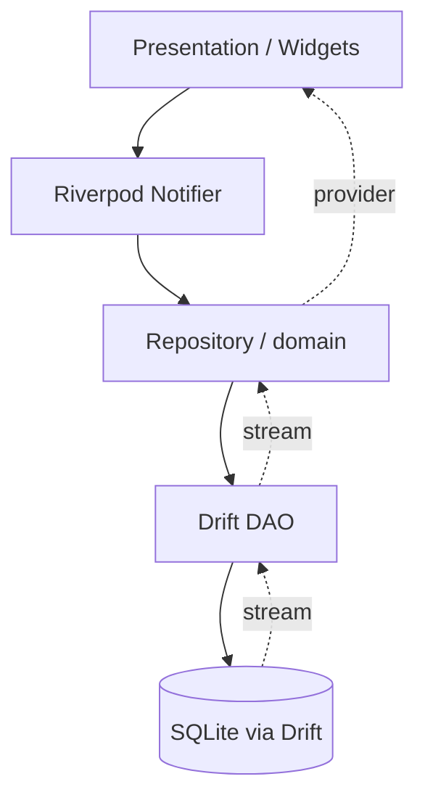
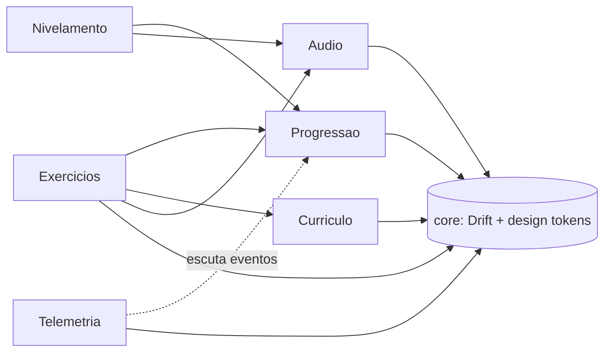

# Architecture Spine — CatEar

## Design Paradigm

**Feature-first modular monolith.** Um único app Flutter, sem backend no v1. Cada feature é um módulo autocontido com suas próprias camadas de dados/domínio/apresentação; um núcleo compartilhado (`core/`) fornece persistência (Drift) e tokens de design. Módulos: **Nivelamento**, **Exercícios**, **Progressão**, **Áudio/Voz**, **Currículo**, **Telemetria** (passivo, opcional).

A regra que dá nome ao paradigma — **dono único de estado** — é o que impede dois módulos construídos independentemente de escreverem o mesmo dado de formas incompatíveis (ver AD-2).

## Invariants & Rules

### AD-1 — Módulos por feature, não por camada técnica

- **Binds:** todo o código de aplicação.
- **Prevents:** um módulo técnico transversal (ex: "services/", "controllers/") viraria um catch-all onde regras de features diferentes se misturam e passam a depender umas das outras de forma implícita.
- **Rule:** cada módulo (`nivelamento/`, `exercicios/`, `progressao/`, `audio/`, `curriculo/`) contém sua própria `data/`, `domain/` e `presentation/`. Nenhum módulo importa a camada `presentation/` de outro módulo — comunicação entre módulos só via `domain/` (contratos/interfaces) ou eventos.

  **Enforcement (não só convenção):** cada módulo expõe um único arquivo barrel público (`{modulo}.dart`, reexportando só o necessário de `domain/`); `data/` e `presentation/` de um módulo nunca são importados fora dele — reforçado com a regra de lint `implementation_imports` do pacote `custom_lint`/`import_lint` configurada no CI local desde o início (mesmo hobby/solo), porque o PRD/deck já preveem possíveis colaboradores futuros — depender só de disciplina pessoal não escala pra esse cenário.

### AD-2 — Dono único por dado persistente (single-writer)

- **Binds:** Medidor de Habilidade, Medidor de Esforço, Skill Tree (estado dos nós, incluindo o nó capstone de Audiação), Baseline Dia 1, dificuldade adaptativa, histórico de variações recentes por tipo de exercício (FR-6), tabela `telemetry_events` (dono: Telemetria — ver AD-6).
- **Prevents:** o módulo de Exercícios e o módulo de Progressão calculando/gravando o mesmo medidor com lógicas diferentes, gerando estado inconsistente (ex: Esforço divergente entre a tela Home e a tela Progresso); dois módulos decidindo de forma incompatível quem controla repetição de exercícios.
- **Rule:** o módulo **Progressão** é o único autorizado a escrever Medidor de Habilidade, Medidor de Esforço, estado de nós do Skill Tree (enum: `bloqueado | disponível | completo | em_reforço | capstone_futuro` — o nó de Audiação nasce fixo em `capstone_futuro`, nunca navegável na v1), Baseline, decisão de dificuldade adaptativa, e o histórico de variações recentes por tipo de exercício. Qualquer outro módulo só lê esses dados via `domain/` do Progressão.

  **Transporte dos eventos:** não há event bus global (reintroduziria o catch-all que AD-1 evita). A Progressão expõe no seu `domain/` um método de ingestão (ex: `ingest(SessionResultReported)` / `recordBaseline(BaselineRecorded)`); o emissor chama via provider Riverpod. O contrato é o tipo do evento, não o canal.

  Dois eventos de domínio, com contrato de campos fixado aqui (não deixado para implementação divergir):
  - **`SessionResultReported`** (Exercícios → Progressão): `sessionId: String`, `attempts: List<ExerciseAttempt>` (uma entrada por tentativa, não agregado por sessão — agregação é responsabilidade da Progressão, não do Exercícios), onde `ExerciseAttempt = { exerciseType: ExerciseType (enum do Currículo, AD-4), wasCorrect: bool, errorType: ErrorType? (enum definido no domínio do Currículo, AD-4 — nunca string livre), reactionTimeMs: int }`.
  - **`BaselineRecorded`** (Exercícios → Progressão): emitido uma única vez, pela **primeira Sessão de Exercício concluída** após o nivelamento (PRD FR-12) — não pelo módulo Nivelamento, que não é uma sessão de treino. Mesmo shape de `attempts` acima; a mesma sessão emite `SessionResultReported` e `BaselineRecorded` na primeira vez. Se essa primeira sessão for abandonada, o registro é adiado até haver uma sessão concluída — nunca feito de dados parciais. A Progressão rejeita um segundo `BaselineRecorded` para o mesmo usuário — a regra de "nunca sobrescrita" (FR-12) é enforced na Progressão, não assumida pelo emissor.

  Dificuldade adaptativa é lida pelo Exercícios como **snapshot no início da sessão** (`Progressão` calcula e fixa o nível ao abrir a Sessão de Exercício), não como stream reativo — evita um exercício mudar de dificuldade no meio da sessão de forma imprevisível para o usuário.

### AD-3 — Áudio/Voz atrás de uma interface única

- **Binds:** módulo Exercícios, módulo Nivelamento.
- **Prevents:** lógica de exercício acoplada diretamente a `just_audio`/`record`/à biblioteca de pitch detection, forçando reescrita de exercícios se a biblioteca de pitch (spike, ver Deferred) precisar trocar; duas implementações de captura assumindo formatos incompatíveis (resultado único vs. stream contínuo).
- **Rule:** todo acesso a reprodução, gravação e avaliação de afinação vocal passa por uma interface `AudioService` (`domain/` do módulo Áudio). `just_audio` e `record` são detalhes de implementação de `AudioService`; nenhum outro módulo importa esses pacotes diretamente.

  Contrato fixado (não deixado para a implementação decidir): a captura vocal segue o mecanismo push-to-talk definido em `EXPERIENCE.md` — gravação acontece enquanto o usuário segura o botão, avaliação roda **depois** que solta. `AudioService.evaluatePitch()` retorna `Future<PitchEvaluationResult>` (resultado único pós-gravação), **não** um `Stream` de amostras em tempo real — não há necessidade de avaliação contínua dado o mecanismo de UX já decidido. `PitchEvaluationResult = { detectedNote: String?, centsOffFromExpected: int?, withinTolerance: bool }`.

  **Implementações `Fake` obrigatórias desde o dia zero** (`FakeAudioService`, cobrindo reprodução, gravação e `evaluatePitch`): vivem em `audio/` e permitem construir e testar toda a lógica de dificuldade adaptativa (Progressão) e de fluxo de exercício injetando frequências/resultados falsos, **sem** microfone físico. Isto é a mitigação direta do Deferred de biblioteca de pitch — a lógica de produto não fica bloqueada pelo spike não resolvido. Nenhum teste de Exercícios/Nivelamento/Progressão depende de hardware de áudio real.

### AD-4 — Currículo é dado, não código

- **Binds:** intervalos, acordes, escalas, andaime de cor (FR-14) e sua curva de fading, módulo de Resolução (FR-15), referências de amostras de áudio, taxonomia de `ExerciseType`/`ErrorType`.
- **Prevents:** conteúdo pedagógico hardcoded espalhado em `if`s dentro da lógica de exercícios, tornando qualquer ajuste de currículo uma mudança de código Dart; duas leituras da intensidade do scaffold de cor que não garantem que ela só diminui.
- **Rule:** o módulo **Currículo** expõe o conteúdo como catálogo de dados versionado (JSON empacotado como asset), com schema fixo:

  ```json
  {
    "stages": [
      {
        "stageId": "string",
        "order": "int (ordem no skill tree, cresce monotonicamente)",
        "exercises": [
          {
            "exerciseType": "enum: interval | chord | scale | resolution",
            "audioSampleRefs": ["string (id de asset em assets/audio/)"],
            "scaffoldIntensity": "float 0.0-1.0 (obrigatório se exerciseType usa scaffold de cor)"
          }
        ]
      }
    ],
    "errorTypes": ["string (taxonomia canônica de ErrorType, única fonte de verdade)"]
  }
  ```

  `ExerciseType` e `ErrorType` (usados no evento `SessionResultReported`, AD-2) são definidos **só aqui** — o módulo Exercícios nunca inventa um tipo de erro fora dessa lista. **Invariante de fading**: para qualquer sequência de estágios em ordem crescente que usem scaffold de cor, `scaffoldIntensity` deve ser não-crescente (`stage[n].scaffoldIntensity <= stage[n-1].scaffoldIntensity`) — validado por um teste/lint de conteúdo antes de qualquer build, não apenas por convenção. O módulo Exercícios lê desse catálogo via `domain/` do Currículo; nunca embute dados de currículo na própria lógica.

### AD-5 — Fluxo de mutação de estado: UI → Notifier → Repository → Drift

- **Binds:** todos os módulos com estado persistente.
- **Prevents:** widgets escrevendo direto no banco (Drift), ou dois pontos da UI mutando o mesmo provider de formas divergentes sem passar pelo mesmo caminho.
- **Rule:** toda mutação segue `UI → Riverpod Notifier → Repository (domain) → Drift DAO`. Leitura é reativa: Drift stream → Repository → Riverpod provider → UI. Nenhuma tela chama Drift diretamente.

  **Isolamento de infra:** `core/` expõe apenas o `Database` Drift e os DAOs. As **interfaces de repositório e os modelos de domínio puros** (data classes, sem anotação de ORM) vivem no `domain/` de cada módulo; a tradução row-do-Drift → modelo puro acontece só em `data/`. Classes/tabelas geradas pelo Drift **nunca cruzam a fronteira `data/ → domain/`** — nenhum módulo consumidor (ex: Progressão lendo baseline) enxerga que Drift existe. Reforçado pela mesma regra de lint `implementation_imports` de AD-1.

### AD-6 — Telemetria é consumidor passivo, nunca escritor de estado de produto

- **Binds:** módulo `telemetria/`, tabela `telemetry_events`.
- **Prevents:** um módulo de observabilidade que, para "enriquecer" métricas, começa a gravar ou corrigir medidores/skill tree/baseline — violando o dono único (AD-2); ou telemetria que exige rede no v1 local-first.
- **Rule:** Telemetria **só escuta** eventos de domínio já existentes (`SessionResultReported`, `BaselineRecorded`) e **só lê** via `domain/` de outros módulos. Ela é dona exclusiva de uma única tabela nova, `telemetry_events` (logs estruturados append-only, local via Drift, seguindo AD-5) — nenhum outro módulo escreve nela, e ela não escreve em nenhuma outra. Nada sai do dispositivo no v1. O módulo é opcional, atrás de uma flag de compilação; o app funciona idêntico com ele desligado. Objetivo: calibrar se a baseline e a curva da Skill Tree estão punitivas ou fáceis demais, com dados reais.





## Consistency Conventions

| Concern | Convention |
| --- | --- |
| Naming (entities, files, interfaces, events) | Módulos e arquivos em `snake_case`; classes/tipos em `PascalCase`; eventos de domínio sufixados `...Reported`/`...Requested` (ex: `SessionResultReported`). |
| Data & formats | IDs de entidade como `String` (UUID v4). Datas em ISO 8601 UTC no banco; conversão pra local só na apresentação. |
| State & cross-cutting | Erros de domínio como tipos selados (`sealed class`) por módulo, nunca exceptions genéricas cruzando fronteira de módulo. Estado assíncrono via `AsyncValue` do Riverpod em toda a árvore de providers. |

## Stack

| Name | Version |
| --- | --- |
| Flutter | 3.47.x (stable — 3.44.0 era a versão no momento da pesquisa inicial; confirmar patch exato no início da implementação, `docs.flutter.dev` é a fonte) |
| Riverpod (codegen) | 3.4.2 (verificado no Reviewer Gate) |
| Drift | 2.34.3 (verificado no Reviewer Gate) |
| record | 7.1.1 (verificado no Reviewer Gate) |
| just_audio | 0.10.6 (verificado no Reviewer Gate) |
| pitch detection lib | **não fixado** — spike técnico, ver Deferred |

## Structural Seed

```text
lib/
  core/                  # Drift database, design tokens, shared widgets
  nivelamento/
    data/ domain/ presentation/
  exercicios/
    data/ domain/ presentation/
  progressao/
    data/ domain/ presentation/
  audio/
    data/ domain/ presentation/   # AudioService interface + impl (just_audio, record, pitch)
  curriculo/
    data/ domain/ presentation/   # leitura do catálogo JSON
  telemetria/
    data/ domain/                  # opcional (flag); escuta eventos, escreve telemetry_events
assets/
  curriculo/             # catálogo JSON versionado (schema fixo, AD-4)
  audio/                 # amostras de instrumento real pré-renderizadas
```

## Deferred

- **Biblioteca de detecção de pitch**: nenhuma opção madura padrão de mercado no ecossistema Flutter (`pitch_detector_dart` sem publicação há ~2 anos; `flutter_pitch_detection` é Android-only, não cobre iOS). Fica isolada atrás de `AudioService` (AD-3, contrato já fixado) justamente para não travar o resto; usuário valida tecnicamente — incluindo a lacuna de cobertura iOS — antes de comprometer a implementação de produção vocal.
- **Voz obrigatória em Nivelamento/Resolução sem fallback**: decisão de produto confirmada com o usuário (não é gap de arquitetura) — quem não pode/quer usar voz fica bloqueado nessas duas etapas específicas no v1. Risco de acessibilidade conhecido e aceito, não escondido; revisitar se virar atrito real de usuários reais.
- **Offline / sincronização**: `EXPERIENCE.md` menciona progresso "sincroniza ao voltar a conexão" — no v1 local-first (sem backend) isso não se aplica a servidor remoto; entende-se como continuar a sessão com amostras de áudio já embarcadas no app (sem download remoto necessário) e persistir tudo local via Drift, sempre disponível. Sincronização entre dispositivos via backend real é v2 (ver item abaixo) — `EXPERIENCE.md` deve ser lido com essa leitura até ser atualizado explicitamente.
- **Backend/conta/sincronização em nuvem**: fora do v1 por decisão de escopo (app local-first). Se entrar em v2, o dono único de cada dado (AD-2) e o fluxo Repository (AD-5) já isolam onde um adapter de sincronização entraria, sem redesenho de módulo.
- **Testes automatizados**: sem estratégia geral fixada neste v1 hobby — decisão adiada para quando houver código para testar contra. Duas âncoras já fixadas mesmo assim: o invariante de fading do currículo (AD-4) pede um teste/lint de conteúdo específico, e os `Fake` de `AudioService` (AD-3) são obrigatórios de saída.
- **Analytics remoto / métricas de produto fora do device**: fora do v1. A telemetria local passiva (AD-6) coleta logs estruturados no próprio dispositivo para calibração; enviar qualquer coisa para fora exigiria backend (ver item abaixo) e é decisão de v2.
- **Atualização remota de currículo (OTA)**: AD-4 mantém a porta aberta (currículo é dado versionado com schema fixo, e `CurriculoRepository.load()` não promete origem). Mecanismo de fetch remoto + cache + fallback embarcado é feature de produto que contradiz o escopo "v1 local-first sem backend" — decidir no PRD antes de puxar para a arquitetura.
- **Distribuição em loja (App Store/Play Store)**: builds locais/debug no início; app id, ícones, splash e assinatura devem ser configurados cedo para não exigir retrabalho quando a publicação for decidida. Build flavors (dev vs. release) também ficam para quando a necessidade de separar ambientes surgir — v1 hobby solo não precisa disso de saída.
